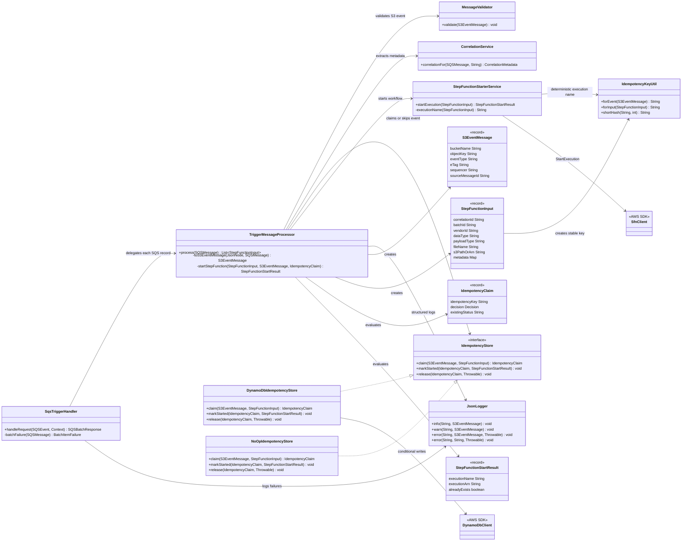
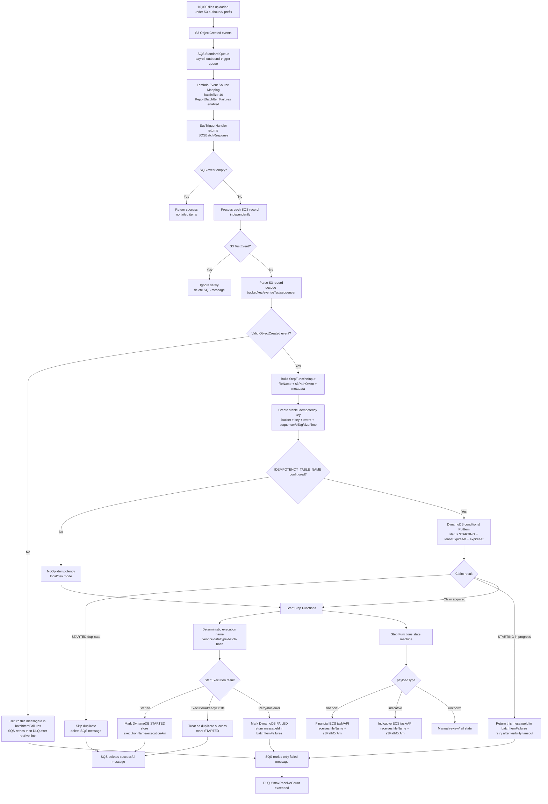

# SQS Trigger Lambda Architecture

## Architecture Class Diagram

## Solution Diagram

## Negative Scenario Coverage

| Scenario | Handling |
| --- | --- |
| 10,000 files arrive together | SQS buffers events; Lambda drains in batches. |
| One SQS record fails in a batch | Only that `messageId` is returned in `batchItemFailures`. |
| Duplicate S3/SQS event | DynamoDB `STARTED` record skips duplicate. |
| Same event already being started | DynamoDB `STARTING` record causes retry later. |
| Lambda crashes after claim before Step Functions | `leaseExpiresAt` allows reclaim after the in-progress lease expires. |
| Step Functions duplicate execution name | `ExecutionAlreadyExists` is treated as duplicate success. |
| Malformed JSON or missing S3 fields | Failed message retries and eventually moves to DLQ. |
| DynamoDB temporarily unavailable | Message retries through SQS. |
| Step Functions temporarily unavailable | Claim is marked `FAILED`; message retries. |
| Permanent poison message | SQS redrive policy moves it to DLQ. |
